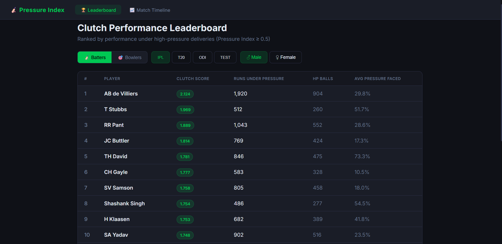
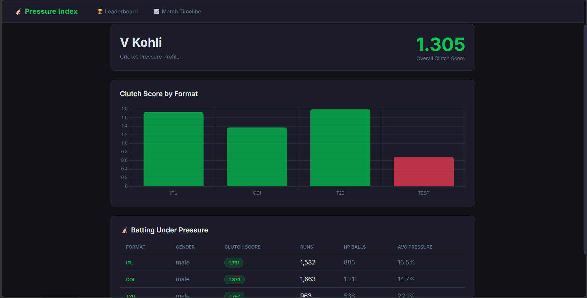
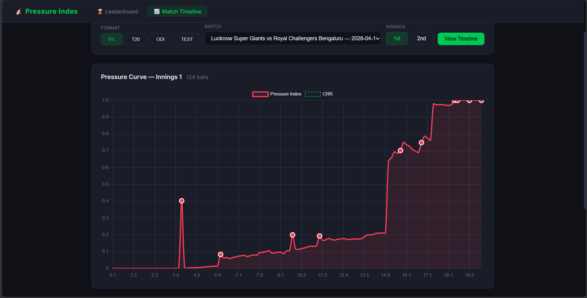

<div align="center">

<!-- Static header SVG — GitHub-safe (no style/animation tags) -->
<svg width="100%" viewBox="0 0 680 160" xmlns="http://www.w3.org/2000/svg">
  <rect width="680" height="160" rx="12" fill="#0f1117"/>
  <!-- Pressure curve (static) -->
  <polyline points="40,130 80,128 120,125 160,120 200,115 240,100 280,80 300,50 320,30 340,25 360,30 380,45 400,70 420,100 460,118 500,124 540,127 580,129 620,130" fill="none" stroke="#ff3d57" stroke-width="1.5" opacity="0.5" stroke-dasharray="6 4"/>
  <!-- Wicket dots -->
  <circle cx="300" cy="50" r="5" fill="#ff3d57"/>
  <circle cx="340" cy="25" r="5" fill="#ff3d57"/>
  <circle cx="380" cy="45" r="5" fill="#ff3d57"/>
  <!-- Title -->
  <text x="340" y="68" text-anchor="middle" font-family="system-ui,sans-serif" font-size="28" font-weight="700" fill="#ffffff">Pressure Index Engine</text>
  <!-- Subtitle -->
  <text x="340" y="98" text-anchor="middle" font-family="system-ui,sans-serif" font-size="13" fill="#64748b">Cricket Clutch Performance Analytics · 4.8M Deliveries · XGBoost · 0.97 ROC-AUC</text>
  <!-- Green accent line -->
  <rect x="270" y="112" width="140" height="2" rx="1" fill="#00c853"/>
  <!-- Stats row -->
  <text x="160" y="142" text-anchor="middle" font-family="system-ui,sans-serif" font-size="11" fill="#00c853" font-weight="600">4.8M</text>
  <text x="160" y="156" text-anchor="middle" font-family="system-ui,sans-serif" font-size="10" fill="#64748b">Deliveries</text>
  <text x="280" y="142" text-anchor="middle" font-family="system-ui,sans-serif" font-size="11" fill="#00c853" font-weight="600">0.97</text>
  <text x="280" y="156" text-anchor="middle" font-family="system-ui,sans-serif" font-size="10" fill="#64748b">ROC-AUC</text>
  <text x="400" y="142" text-anchor="middle" font-family="system-ui,sans-serif" font-size="11" fill="#00c853" font-weight="600">10,363</text>
  <text x="400" y="156" text-anchor="middle" font-family="system-ui,sans-serif" font-size="10" fill="#64748b">Matches</text>
  <text x="520" y="142" text-anchor="middle" font-family="system-ui,sans-serif" font-size="11" fill="#00c853" font-weight="600">2,627</text>
  <text x="520" y="156" text-anchor="middle" font-family="system-ui,sans-serif" font-size="10" fill="#64748b">Player Profiles</text>
</svg>

<br/><br/>

[](https://lovely-monstera-f0f583.netlify.app)
[](https://pressure-index-production.up.railway.app/docs)
[](https://python.org)
[](https://xgboost.readthedocs.io)
[](https://fastapi.tiangolo.com)
[](https://react.dev)

</div>

---

## 🏏 What is the Pressure Index?

Cricket commentary has always used the word *pressure* loosely — but no public tool has ever quantified it per delivery. The **Pressure Index Engine** fills that gap.

Every delivery across **4.8 million balls** is assigned a Pressure Index score (0–1) by an XGBoost model trained on 8 match-context features. Those scores are aggregated into **Clutch Scores** per player — measuring how they perform *specifically when it matters most*.

---

## ✨ Features

| View | Description |
|---|---|
| 🏆 **Leaderboard** | Ranked clutch scores for batters and bowlers — filterable by format (IPL / T20 / ODI / Test) and gender |
| 👤 **Player Profile** | Per-player pressure breakdown across formats with Chart.js bar charts |
| 📈 **Match Timeline** | Full innings pressure curve with wicket annotations and peak pressure moments |

---

## 📸 Screenshots

### Leaderboard


### Player Profile


### Match Timeline


**Leaderboard** — AB de Villiers, RR Pant, V Kohli ranking by IPL Clutch Score  
**Player Profile** — Format-by-format clutch score bar chart + stats table  
**Match Timeline** — LSG vs RCB pressure curve spiking at wickets in death overs  

---

## 🏗️ Architecture

<div align="center">

<!-- Architecture SVG — GitHub-safe (no style/animation tags) -->
<svg width="100%" viewBox="0 0 680 280" xmlns="http://www.w3.org/2000/svg">
  <defs>
    <marker id="arr" viewBox="0 0 10 10" refX="8" refY="5" markerWidth="6" markerHeight="6" orient="auto-start-reverse">
      <path d="M2 1L8 5L2 9" fill="none" stroke="#00c853" stroke-width="1.5" stroke-linecap="round" stroke-linejoin="round"/>
    </marker>
    <marker id="arr2" viewBox="0 0 10 10" refX="8" refY="5" markerWidth="6" markerHeight="6" orient="auto-start-reverse">
      <path d="M2 1L8 5L2 9" fill="none" stroke="#2d3149" stroke-width="1.5" stroke-linecap="round" stroke-linejoin="round"/>
    </marker>
  </defs>
  <rect width="680" height="280" rx="12" fill="#0f1117"/>
  <!-- Top row boxes -->
  <!-- Cricsheet -->
  <rect x="30" y="30" width="120" height="60" rx="8" fill="#1a1d27" stroke="#00c853" stroke-width="0.8"/>
  <text x="90" y="55" text-anchor="middle" font-family="system-ui,sans-serif" font-size="11" font-weight="600" fill="#00c853">Cricsheet</text>
  <text x="90" y="72" text-anchor="middle" font-family="system-ui,sans-serif" font-size="10" fill="#64748b">10,363 YAML files</text>
  <!-- Ingestion -->
  <rect x="190" y="30" width="120" height="60" rx="8" fill="#1a1d27" stroke="#2d3149" stroke-width="0.8"/>
  <text x="250" y="55" text-anchor="middle" font-family="system-ui,sans-serif" font-size="11" font-weight="600" fill="#e2e8f0">Ingestion</text>
  <text x="250" y="72" text-anchor="middle" font-family="system-ui,sans-serif" font-size="10" fill="#64748b">ingest.py · 4.8M rows</text>
  <!-- Feature Eng -->
  <rect x="350" y="30" width="120" height="60" rx="8" fill="#1a1d27" stroke="#2d3149" stroke-width="0.8"/>
  <text x="410" y="50" text-anchor="middle" font-family="system-ui,sans-serif" font-size="11" font-weight="600" fill="#e2e8f0">Feature Eng.</text>
  <text x="410" y="65" text-anchor="middle" font-family="system-ui,sans-serif" font-size="10" fill="#64748b">8 pressure features</text>
  <text x="410" y="80" text-anchor="middle" font-family="system-ui,sans-serif" font-size="10" fill="#64748b">per delivery</text>
  <!-- XGBoost -->
  <rect x="510" y="30" width="140" height="60" rx="8" fill="#1a1d27" stroke="#ff3d57" stroke-width="0.8"/>
  <text x="580" y="50" text-anchor="middle" font-family="system-ui,sans-serif" font-size="11" font-weight="600" fill="#ff3d57">XGBoost Model</text>
  <text x="580" y="65" text-anchor="middle" font-family="system-ui,sans-serif" font-size="10" fill="#64748b">0.97 ROC-AUC</text>
  <text x="580" y="80" text-anchor="middle" font-family="system-ui,sans-serif" font-size="10" fill="#64748b">Pressure Index 0→1</text>
  <!-- Top row arrows -->
  <line x1="150" y1="60" x2="188" y2="60" stroke="#00c853" stroke-width="1" marker-end="url(#arr)"/>
  <line x1="310" y1="60" x2="348" y2="60" stroke="#2d3149" stroke-width="1" marker-end="url(#arr2)" stroke-dasharray="3 2"/>
  <line x1="470" y1="60" x2="508" y2="60" stroke="#2d3149" stroke-width="1" marker-end="url(#arr2)" stroke-dasharray="3 2"/>
  <!-- Arrow down from XGBoost -->
  <line x1="580" y1="90" x2="580" y2="148" stroke="#2d3149" stroke-width="1" marker-end="url(#arr2)" stroke-dasharray="3 2"/>
  <!-- Bottom row boxes -->
  <!-- PostgreSQL -->
  <rect x="30" y="150" width="130" height="60" rx="8" fill="#1a1d27" stroke="#2d3149" stroke-width="0.8"/>
  <text x="95" y="175" text-anchor="middle" font-family="system-ui,sans-serif" font-size="11" font-weight="600" fill="#e2e8f0">PostgreSQL</text>
  <text x="95" y="192" text-anchor="middle" font-family="system-ui,sans-serif" font-size="10" fill="#64748b">Supabase (prod)</text>
  <!-- FastAPI -->
  <rect x="200" y="150" width="130" height="60" rx="8" fill="#1a1d27" stroke="#2d3149" stroke-width="0.8"/>
  <text x="265" y="175" text-anchor="middle" font-family="system-ui,sans-serif" font-size="11" font-weight="600" fill="#e2e8f0">FastAPI</text>
  <text x="265" y="192" text-anchor="middle" font-family="system-ui,sans-serif" font-size="10" fill="#64748b">6 REST endpoints</text>
  <!-- React -->
  <rect x="370" y="150" width="130" height="60" rx="8" fill="#1a1d27" stroke="#00c853" stroke-width="0.8"/>
  <text x="435" y="175" text-anchor="middle" font-family="system-ui,sans-serif" font-size="11" font-weight="600" fill="#00c853">React Dashboard</text>
  <text x="435" y="192" text-anchor="middle" font-family="system-ui,sans-serif" font-size="10" fill="#64748b">Netlify · Chart.js</text>
  <!-- Clutch Scores -->
  <rect x="510" y="150" width="140" height="60" rx="8" fill="#1a1d27" stroke="#2d3149" stroke-width="0.8"/>
  <text x="580" y="175" text-anchor="middle" font-family="system-ui,sans-serif" font-size="11" font-weight="600" fill="#e2e8f0">Clutch Scores</text>
  <text x="580" y="192" text-anchor="middle" font-family="system-ui,sans-serif" font-size="10" fill="#64748b">2,627 player profiles</text>
  <!-- Bottom row arrows -->
  <line x1="160" y1="180" x2="198" y2="180" stroke="#2d3149" stroke-width="1" marker-end="url(#arr2)" stroke-dasharray="3 2"/>
  <line x1="330" y1="180" x2="368" y2="180" stroke="#2d3149" stroke-width="1" marker-end="url(#arr2)" stroke-dasharray="3 2"/>
  <line x1="500" y1="180" x2="508" y2="180" stroke="#2d3149" stroke-width="1" marker-end="url(#arr2)" stroke-dasharray="3 2"/>
  <!-- DB feeds FastAPI arc -->
  <path d="M95 210 Q95 240 265 240 Q265 210 265 210" fill="none" stroke="#2d3149" stroke-width="0.8" stroke-dasharray="3 2" marker-end="url(#arr2)"/>
  <!-- Footer label -->
  <text x="340" y="258" text-anchor="middle" font-family="system-ui,sans-serif" font-size="10" fill="#64748b">Data Flow · Pre-computed scores · Sub-100ms API responses</text>
</svg>

</div>

---

## 🧠 The Model

### How Pressure Outcome is Defined

A delivery is labelled as a high-pressure outcome if **any** of these conditions hold:
- A **wicket fell**
- The batter scored **0 runs** while the team is **chasing and behind** (RRR > CRR)
- It occurred in the **death overs** (phase 2)
- **Fewer than 4 wickets remain**

After tuning, this produces a **19.74% positive rate** — healthy for learning without extreme imbalance.

### Feature Importances

```
wicket_pressure        ████████████████████████████████████░░░░░  71.4%
phase                  ██████████░░░░░░░░░░░░░░░░░░░░░░░░░░░░░░░  18.8%
balls_remaining_norm   ████░░░░░░░░░░░░░░░░░░░░░░░░░░░░░░░░░░░░░   6.2%
crr                    █░░░░░░░░░░░░░░░░░░░░░░░░░░░░░░░░░░░░░░░░   1.9%
partnership_balls      █░░░░░░░░░░░░░░░░░░░░░░░░░░░░░░░░░░░░░░░░   1.7%
rrr / run_rate_pres.   ░░░░░░░░░░░░░░░░░░░░░░░░░░░░░░░░░░░░░░░░░   0.0%
```

### Results

```
ROC-AUC Score           :  0.9748
Overall Accuracy        :  93%
Pressure Recall         :  92%
Training deliveries     :  3,867,797
Test deliveries         :  966,950
```

---

## 🛠️ Tech Stack

<div align="center">

<!-- Tech stack SVG — GitHub-safe (no style/animation tags) -->
<svg width="100%" viewBox="0 0 680 100" xmlns="http://www.w3.org/2000/svg">
  <rect width="680" height="100" rx="10" fill="#0f1117"/>
  <!-- Row 1 boxes -->
  <rect x="20"  y="12" width="72" height="44" rx="8" fill="#1a1d27" stroke="#2d3149" stroke-width="0.8"/>
  <text x="56"  y="32" text-anchor="middle" font-family="system-ui,sans-serif" font-size="10" font-weight="600" fill="#3776AB">Python</text>
  <text x="56"  y="48" text-anchor="middle" font-family="system-ui,sans-serif" font-size="9"  fill="#64748b">3.13</text>

  <rect x="104" y="12" width="72" height="44" rx="8" fill="#1a1d27" stroke="#2d3149" stroke-width="0.8"/>
  <text x="140" y="32" text-anchor="middle" font-family="system-ui,sans-serif" font-size="10" font-weight="600" fill="#FF6600">XGBoost</text>
  <text x="140" y="48" text-anchor="middle" font-family="system-ui,sans-serif" font-size="9"  fill="#64748b">ML Model</text>

  <rect x="188" y="12" width="72" height="44" rx="8" fill="#1a1d27" stroke="#2d3149" stroke-width="0.8"/>
  <text x="224" y="32" text-anchor="middle" font-family="system-ui,sans-serif" font-size="10" font-weight="600" fill="#e2e8f0">Pandas</text>
  <text x="224" y="48" text-anchor="middle" font-family="system-ui,sans-serif" font-size="9"  fill="#64748b">Data Eng.</text>

  <rect x="272" y="12" width="72" height="44" rx="8" fill="#1a1d27" stroke="#00c853" stroke-width="0.8"/>
  <text x="308" y="32" text-anchor="middle" font-family="system-ui,sans-serif" font-size="10" font-weight="600" fill="#009688">FastAPI</text>
  <text x="308" y="48" text-anchor="middle" font-family="system-ui,sans-serif" font-size="9"  fill="#64748b">Backend</text>

  <rect x="356" y="12" width="72" height="44" rx="8" fill="#1a1d27" stroke="#2d3149" stroke-width="0.8"/>
  <text x="392" y="32" text-anchor="middle" font-family="system-ui,sans-serif" font-size="10" font-weight="600" fill="#336791">PostgreSQL</text>
  <text x="392" y="48" text-anchor="middle" font-family="system-ui,sans-serif" font-size="9"  fill="#64748b">Database</text>

  <rect x="440" y="12" width="72" height="44" rx="8" fill="#1a1d27" stroke="#00c853" stroke-width="0.8"/>
  <text x="476" y="32" text-anchor="middle" font-family="system-ui,sans-serif" font-size="10" font-weight="600" fill="#61DAFB">React</text>
  <text x="476" y="48" text-anchor="middle" font-family="system-ui,sans-serif" font-size="9"  fill="#64748b">Frontend</text>

  <rect x="524" y="12" width="72" height="44" rx="8" fill="#1a1d27" stroke="#2d3149" stroke-width="0.8"/>
  <text x="560" y="32" text-anchor="middle" font-family="system-ui,sans-serif" font-size="10" font-weight="600" fill="#e2e8f0">Chart.js</text>
  <text x="560" y="48" text-anchor="middle" font-family="system-ui,sans-serif" font-size="9"  fill="#64748b">Charts</text>

  <rect x="608" y="12" width="52" height="44" rx="8" fill="#1a1d27" stroke="#2d3149" stroke-width="0.8"/>
  <text x="634" y="32" text-anchor="middle" font-family="system-ui,sans-serif" font-size="10" font-weight="600" fill="#00c853">Railway</text>
  <text x="634" y="48" text-anchor="middle" font-family="system-ui,sans-serif" font-size="9"  fill="#64748b">Deploy</text>

  <!-- Row 2 label -->
  <text x="340" y="82" text-anchor="middle" font-family="system-ui,sans-serif" font-size="10" fill="#64748b">Supabase · Netlify · SQLAlchemy · Scikit-Learn · Vite · Joblib</text>
</svg>

</div>

| Layer | Technology | Why |
|---|---|---|
| Data | Cricsheet YAML | Free, complete ball-by-ball data for all professional cricket |
| ML | XGBoost | Best for tabular classification; interpretable feature importances |
| Database | PostgreSQL + Supabase | Window functions, bulk inserts, managed cloud hosting |
| Backend | FastAPI | Async-ready, auto Swagger docs, Pydantic validation |
| Frontend | React + Vite + Chart.js | Fast HMR; Chart.js for custom wicket dot annotations |
| Hosting | Railway + Netlify | Git-push auto-deploy for both API and frontend |

---

## 🚀 Run Locally

### Prerequisites
- Python 3.10+, Node.js 18+, PostgreSQL 15+

### Backend
```bash
cd backend
pip install -r requirements.txt
cp .env.example .env          # Add your PostgreSQL credentials

python schema.py              # Create tables
python ingest.py              # Parse Cricsheet YAMLs → DB (~30 min)
python features.py            # Compute 8 pressure features (~10 min)
python model.py               # Train XGBoost + player stats (~15 min)

uvicorn main:app --reload --port 8000
```

### Frontend
```bash
cd frontend/frontend
npm install
echo "VITE_API_URL=http://localhost:8000" > .env
npm run dev
# Open http://localhost:5173
```

---

## 📡 API Reference

**Base URL:** `https://pressure-index-production.up.railway.app`

| Method | Endpoint | Description |
|---|---|---|
| GET | `/players/batters` | Paginated clutch batter leaderboard |
| GET | `/players/bowlers` | Paginated clutch bowler leaderboard |
| GET | `/players/{name}/profile` | Full pressure profile for one player |
| GET | `/players/compare` | Head-to-head clutch comparison |
| GET | `/matches/` | List matches (filterable by format/team) |
| GET | `/matches/{id}/timeline` | Full innings pressure curve |

Query params: `format` (ipl/t20/odi/test) · `gender` (male/female) · `page` · `limit`

Interactive docs → [`/docs`](https://pressure-index-production.up.railway.app/docs)

---

## 📁 Project Structure

```
pressure-index/
├── backend/
│   ├── main.py              # FastAPI entry point + CORS
│   ├── ingest.py            # Cricsheet dual-schema YAML parser
│   ├── features.py          # 8-feature pressure engineering pipeline
│   ├── model.py             # XGBoost training + Clutch Score aggregation
│   ├── push_to_supabase.py  # Production DB slim table migration
│   ├── schema.py            # SQLAlchemy table definitions
│   ├── db.py                # PostgreSQL connection + session
│   └── routes/
│       ├── players.py       # Leaderboard, profile, compare endpoints
│       └── matches.py       # Match list + timeline endpoints
├── frontend/frontend/
│   └── src/
│       ├── pages/
│       │   ├── Leaderboard.jsx
│       │   ├── PlayerProfile.jsx
│       │   └── MatchTimeline.jsx
│       └── components/
│           └── Navbar.jsx
├── models/                  # Saved pressure_model.pkl (gitignored)
├── data/raw/                # Cricsheet YAMLs (gitignored — download separately)
└── netlify.toml             # Netlify build config
```

---

## 🔮 Future Scope

- **Live match streaming** — Redis + Kafka ingestion for real-time Pressure Index during live matches
- **Format-specific models** — Separate XGBoost per format (Test pressure ≠ T20 pressure)
- **SHAP explanations** — Per-delivery feature attribution shown on the timeline
- **Partnership Pressure Index** — Extend metrics to batting pairs
- **Shareable match reports** — Auto-generated PDF summaries with annotated pressure curves

---

<div align="center">

**[Live Dashboard](https://lovely-monstera-f0f583.netlify.app)** · **[API Docs](https://pressure-index-production.up.railway.app/docs)** · **[GitHub](https://github.com/shriyashsk/pressure-index)**

<sub>Built by <a href="https://linkedin.com/in/shriyashsk">Shriyash Kulkarni</a> · MIT Bengaluru · 2026</sub>

</div>
